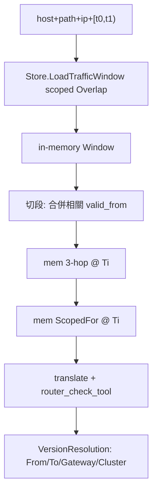

# POC 區間查詢：去物化 valid_to + in-memory 切段

## 定案

- **Backend**：`chstore` / `pgstore` / `mariastore` 一併改（共用 [`store.Store`](poc/route2a/internal/store/store.go) 契約）。
- **深度**：store 層 + 區間查詢編排（`ipflow` 可查 `[t0,t1)`，回 per-version）。
- **單點 API 保留**：`ResolveIPToGateways(t)` / `ScopedFor(t)` / `AsOfRev(t)` 仍給 verify 與除錯；SQL 改為無 `valid_to` 欄。
- **區間路徑**：scoped Overlap **一次**撈進記憶體 → 切段 → in-memory 3-hop/`ScopedFor` → 每段 translate + `router_check_tool`。
- **Benchmark 預設區間**：`bench-worst` / `bench-warm` 改走上述區間路徑（不再以固定 `now` 單點 `ScopedFor` 為預設）。



## 1. 契約與語料：拿掉寫入端 `valid_to`

改 [`poc/route2a/internal/store/store.go`](poc/route2a/internal/store/store.go)：

- `ServiceRow` 刪 `ValidTo`；batch `Append` 簽名去掉 `to`（Deploy/Gw/VS 同）。
- `Versions(k)` **仍可**在記憶體算 `From`/`To`（給 `VersionMidTime`、切段語意），但 **不再寫入 DB**；open 版只靠「無下一列」表示。
- `Store` 新增：
  - `LoadTrafficWindow(ctx, ip, t0, t1) (TrafficWindow, error)`：依 IP 收斂後，一次撈齊區間內相關 service/deploy/gw/vs 列（含 `spec_json` 等）。
  - 型別：`TrafficWindow`（各資源版本 slice + 推導用的 `ValidTo` 在 Go 端填好）。

改 [`poc/route2a/internal/ingload/ingload.go`](poc/route2a/internal/ingload/ingload.go)：Append 只傳 `ver.From`，不再傳 `ver.To`。

## 2. 三 backend：DDL / INSERT / 單點查詢

對齊主專案 [`pkg/store/ddl.go`](pkg/store/ddl.go)：**表上無 `valid_to`**。

| 用途 | 新語意（無物化 `valid_to`） |
|------|---------------------------|
| AsOf(T) | `valid_from <= T`，同 identity 取 `ORDER BY valid_from DESC, ingest_seq DESC LIMIT 1` |
| Overlap `[t0,t1)` | window/`lead` 推導 `valid_to`，再 `valid_from < t1 AND t0 < valid_to`；末版 `lead` 預設 `farFuture` |

各 backend 同步改：

- DDL：四表刪 `valid_to` 欄（[`chstore.go`](poc/route2a/internal/chstore/chstore.go)、[`pgstore.go`](poc/route2a/internal/pgstore/pgstore.go)、[`mariastore.go`](poc/route2a/internal/mariastore/mariastore.go)）。
- INSERT：batch 欄位列表去掉 `valid_to`。
- `ResolveIPToGateways` / `ScopedFor` / `AsOfRev` / `backendServices`：改為上述 AsOf 語法（Maria 維持 junction 表策略，只改時間謂詞）。
- 實作 `LoadTrafficWindow`：
  1. Hop1 候選：`has(ingress_ips, ip)`（或 PG/Maria 等價）且與區間重疊的 ingress service 版本。
  2. 同 ns 的 deploy、由 selector 可連到的 gw、`bound_gateways` 命中的 vs、相關 ns 的 backend services——皆 Overlap。
  3. 回傳列在 Go 端依 `(namespace,name)` 排序後填 `ValidTo = next.ValidFrom`（末版 `farFuture`），供切段與 AsOf 共用。

ClickHouse Overlap 示意：

```sql
WITH v AS (
  SELECT *, leadInFrame(valid_from, 1, toDateTime64('2200-01-01', 3))
    OVER (PARTITION BY namespace, name ORDER BY valid_from
          ROWS BETWEEN UNBOUNDED PRECEDING AND UNBOUNDED FOLLOWING) AS valid_to
  FROM service_versions FINAL
)
SELECT ... FROM v
WHERE has(ingress_ips, {ip}) AND valid_from < {t1} AND {t0} < valid_to
```

PG/Maria 用對應 `lead(...) OVER (...)`（Maria 若 window 受限則用「同 identity 下一列 `valid_from`」相關子查詢，語意相同）。

## 3. In-memory 切段 / 3-hop / ScopedFor

新增套件 [`poc/route2a/internal/memwindow`](poc/route2a/internal/memwindow)（名稱可微調）：

- 輸入：`store.TrafficWindow` + `[t0,t1)`。
- `Segments()`：合併 window 內所有相關列的 `valid_from`（夾在區間內者）與 `t0`/`t1`，得到半開段。
- `ResolveIPToGateways(ip, t)` / `ScopedFor(gw, t)`：對已載入列做與現有 SQL 相同的 `has`/`hasAll`/bound_gateways 邏輯 + AsOf(T)（`valid_from <= t < valid_to`，`valid_to` 已在 Go 推導）。
- **不再**對每段打 DB。

單點路徑可繼續走各 backend 的 SQL 實作（verify / 除錯用）；**benchmark 預設改走 memwindow**。

## 4. 區間查詢 API（2A）

新增 [`poc/route2a/internal/rangequery`](poc/route2a/internal/rangequery)（或掛在 `simulate` 旁）：

```go
type VersionResolution struct {
  From, To time.Time
  Gateway, Cluster string
}
func Resolve(ctx, st, engBits, host, path, ip, t0, t1) ([]VersionResolution, error)
```

流程：

1. `st.LoadTrafficWindow(ip, t0, t1)`
2. `memwindow` 切段
3. 每段：mem 3-hop → `gwresolve.ResolveAmong` → mem `ScopedFor` → 既有 translate + `router_check_tool`
4. 相鄰段若 `Gateway`+`Cluster` 相同則合併區間（減少噪音）

[`cmd/ipflow`](poc/route2a/cmd/ipflow/main.go)：

- 新增 `-from` / `-to`（RFC3339）；兩者都設時走 `rangequery`，否則維持現有單點 `query`。
- 輸出每個版本的時間區間 + gateway + cluster。

## 5. Benchmark 預設改成區間模式

改 [`poc/route2a/bench_test.go`](poc/route2a/bench_test.go)（及 [`poc/ARCHITECTURE.md`](poc/ARCHITECTURE.md) / Makefile 說明）：

- `TestResolveSingleWorst` / warm batch：每個 case（或每批）改呼叫 `rangequery`，不再 `buildEngine(..., now)` 固定單點。
- 預設視窗：涵蓋語料多版本時間線，例如 `[versionBase, now)` 或 `[VersionMidTime(0), farFuture)`，讓切段 \(N \ge 1\)；可用 env（如 `POC_BENCH_FROM` / `POC_BENCH_TO`）覆寫。
- 計時：在既有六階段上，把 **一次** `LoadTrafficWindow` 計為 load/overlap；切段後的 mem 3-hop/`ScopedFor` 計入 lookup/scopedfetch（或新增 `windowload` stage）；每段仍計 translate/check。報表註明「區間預設、成本隨段數放大」。
- 正確性：與 scalegen oracle 比對時，取「查詢時刻落在 open/最後一版」的 cluster，或對每段分別對應 `VersionMidTime` 期望（POC 語料各版 destination 若相同，則合併後仍 0 mismatch）。
- `make bench-worst` / `bench-warm` 預設即此路徑；單點路徑保留給 `ipflow -mode=verify` 與非 bench 測試。

## 6. 測試與文件

- [`ip_flow_test.go`](poc/route2a/ip_flow_test.go)：單點 AsOf/3-hop 在無 `valid_to` schema 下仍過；新增區間測試——選橫跨至少兩個 VS（或 Gw）`VersionMidTime` 的 `[t0,t1)`，断言回傳 ≥2 段且各段 cluster 與 oracle/單點 AsOf 一致。
- 三 backend 皆跑（既有 `POC_DB` 機制）。
- 更新 [`poc/ARCHITECTURE.md`](poc/ARCHITECTURE.md)：無物化 `valid_to`、Overlap 推導、區間 = scoped load + in-memory 切段；標明單點 vs 區間兩條路徑，以及 **benchmark 預設走區間**。

## 非目標（本次不做）

- 主專案 `pkg/store` 查詢面 / `cmd/query` 移植。
- POC 引入主專案的 `deleted` / `uid` / `spec_hash` envelope（僅對齊「不存 valid_to」）。
