# 任意 GVR 支援計畫

## 目標與設計邊界

- 目標：未來新增 `CronJob`、`Job`、`Ingress`、任意 CRD 時，只在 YAML 宣告 GVR/GVK/scope/rules，Go 程式不再新增 registry entry 或 switch 分支。
- 保留相容性：既有 `watch.resources[].kind: Pod`、`rules[].anchor: Pod`、`source: Deployment` 繼續可用，內建資源可由 legacy kind-only 寫法補齊 GVR。
- Discovery 輔助模式：新增 opt-in 設定，預設不啟用；啟用後可用 `apiVersion + kind` 由 apiserver discovery 補出 `resource` 與 `scope`。
- 新能力：新 YAML resource descriptor 可完整描述 `name`、`group`、`version`、`resource`、`kind`、`scope`、namespace/selector、以及 owner-chain/top-controller 語意；未啟用 discovery 時，非 legacy kind-only resource 必須寫完整 GVR。
- 非目標：不自動產生或套用 RBAC，因 exporter 不應修改叢集權限；改為提供清楚文件、範例與錯誤訊息。

## 建議 YAML Schema

新增「資源識別名稱」作為 rules/source 的穩定引用鍵，避免同一個 `kind` 出現在不同 API group/version 時衝突：

```yaml
watch:
  resources:
    - name: CronJob              # rules[].anchor / labels[].source 使用的邏輯名稱；省略時預設為 kind（僅限不衝突）
      group: batch
      version: v1
      resource: cronjobs         # plural resource，RBAC 也用這個
      kind: CronJob              # ownerReferences 用 GVK 對應 cache
      scope: Namespaced          # Namespaced 或 Cluster
      namespaces: [prod]
      labelSelector: "app=my-app"
      fieldSelector: "metadata.name=my-cronjob"
      owner:
        follow: true             # 預設 true；允許 resolver 沿 ownerReferences 找此 resource
        topController: false     # 取代目前硬編碼 Deployment/StatefulSet/DaemonSet

rules:
  - name: cronjob_info
    anchor: CronJob
    labels:
      cronjob:
        path: metadata.name
```

CRD 範例：

```yaml
watch:
  resources:
    - name: Widget
      group: example.com
      version: v1alpha1
      resource: widgets
      kind: Widget
      scope: Namespaced
```

Discovery 輔助模式預設關閉。啟用後允許只寫 `apiVersion + kind`，由叢集 discovery 在啟動時解析 `resource` 與 `scope`：

```yaml
discovery:
  enabled: true

watch:
  resources:
    - name: CronJob
      apiVersion: batch/v1
      kind: CronJob
```

未啟用 discovery 或 discovery 沒權限時，這種不完整 descriptor 會啟動失敗，錯誤需明確提示補上完整 GVR：

```yaml
watch:
  resources:
    - name: CronJob
      group: batch
      version: v1
      resource: cronjobs
      kind: CronJob
      scope: Namespaced
```

資料流：

```mermaid
flowchart LR
  configYaml["Config YAML"] --> validate["config.Validate"]
  validate --> discoveryOptIn["Discovery Resolver (opt-in)"]
  discoveryOptIn --> registry["Runtime Resource Registry"]
  registry --> informers["Dynamic Informers by GVR"]
  informers --> cache["Cache keyed by resource name"]
  cache --> resolver["Owner Resolver maps GVK to resource name"]
  resolver --> collector["Collector evaluates rules and labels"]
```



## 實作步驟

1. 重塑 config 資源模型於 [pkg/config/config.go](pkg/config/config.go)。
   - 將 `ResourceInfo` / `WatchResource` 擴成可由 YAML 提供 GVR/GVK/scope 的 descriptor。
   - 新增 `name` 作為 canonical resource key；`kind` 只代表 Kubernetes GVK kind。
   - 建立 runtime registry：`byName`、`byKindIfUnique`、`byGVK`、`byGVR`。
   - 保留內建 legacy catalog 僅用於舊的 kind-only config 與預設全 watch，不再限制任意 GVR；catalog 是我們程式內的相容層，不是 client-go 提供的完整目錄。

2. 加入 discovery 輔助解析，預設關閉。
   - 新增頂層設定，例如 `discovery.enabled: false` 作為預設值。
   - 啟用時，允許 `apiVersion + kind` descriptor 省略 `group/version/resource/scope` 中可由 discovery 推導的欄位。
   - 啟動時透過 Kubernetes discovery 查詢實際 cluster 的 APIResourceList，解析 `apiVersion + kind -> group/version/resource/scope/verbs`。
   - 若 discovery API 無權限、不可用、查不到、或找到多個候選 resource，啟動失敗並提示改寫完整 GVR。
   - discovery 只用來補 schema 與 scope，不取代 `get/list/watch` RBAC；LIST/WATCH 權限仍由後續 dry-run/informer 建立驗證。

3. 擴充驗證規則於 [pkg/config/config.go](pkg/config/config.go) 與 [pkg/config/config_test.go](pkg/config/config_test.go)。
   - 驗證 `name/group/version/resource/kind/scope` 必填與格式，`resource` 必須是 lowercase plural DNS-ish 字串，`version` 不可空。
   - 驗證 duplicate `name`、duplicate GVR、duplicate GVK、同 kind alias 衝突。
   - 驗證 `scope=Cluster` 不可設定 `namespaces`；`scope=Namespaced` 可選擇 cluster-wide watch 或 namespace-scoped watch。
   - 驗證 `rules[].anchor`、`labels[].source`、`fallbacks[].source`、`expandLabels[].source` 只能引用 built-ins 或 registry 裡的 `name` / 唯一 kind alias。
   - 對 non-legacy 的不完整 descriptor 給明確錯誤：若 `discovery.enabled=false`，提示「請補完整 `group/version/resource/kind/scope` 或啟用 discovery」；若 discovery 失敗，提示 discovery 權限/API 問題與完整 GVR fallback 範例。

4. 改造 informer/lister 查表於 [pkg/collector/listers.go](pkg/collector/listers.go)。
   - 將 `ScopedInformers` 的 key 從 kind string 改成 resource name，並從 registry 取得 GVR/scope。
   - `DryRunSelectors`、`Get`、`ListAll`、`HasKind/WatchedKinds` 改為 resource-name 語意，錯誤訊息包含 `name`、`gvr`、`scope`、`namespace`。
   - 對 LIST/WATCH RBAC 失敗、API resource 不存在、selector 不合法，保留原始 Kubernetes error 並包上設定位置。

5. 改造 owner resolver 於 [pkg/collector/resolver.go](pkg/collector/resolver.go)。
   - resolver 接收 registry，用 ownerReference 的 `apiVersion + kind` 找到已 watch 的 resource name，而不是只看 `kind` 白名單。
   - Chain 同時放入 `anchor`、`ownerController`、`topController`、resource `name`；只有 kind alias 唯一時才額外放 `Kind`，避免 source 歧義。
   - `topControllerKinds` 改為 config-driven，例如 `owner.topController: true`，內建 Deployment/StatefulSet/DaemonSet 以 legacy default 保持現行行為。
   - 未 watch 的 owner GVK 不視為 fatal，但 warning 要包含 owner GVK、anchor、namespace/name 與建議補 watch resource。

6. 同步 collector 與 CLI log 於 [pkg/collector/collector.go](pkg/collector/collector.go) 和 [cmd/main.go](cmd/main.go)。
   - `rule.Anchor` 解析成 resource name 後再 scrape `ListAll`。
   - self metrics 的 `kind` label 可改名或補 `resource` label需謹慎；若維持既有 metrics，至少以 resource name 輸出，文件說明行為。
   - 啟動 log 顯示完整 watch resources：`name/group/version/resource/kind/scope/namespaces/selectors`。

7. 更新部署與 RBAC 文件。
   - [docs/CONFIG.md](docs/CONFIG.md) 更新 schema、範例、legacy migration、source/anchor 規則、scope 檢查、fieldSelector 說明。
   - [README.md](README.md) 將「支援固定八種資源」改成「內建範例 + 任意 GVR」。
   - [deploy/manifests.yaml](deploy/manifests.yaml) 保留內建資源 RBAC，新增註解或範例段落說明 CronJob/Job/Ingress/CRD 需手動加入 `apiGroups/resources/get/list/watch`。
   - 文件明確說明 discovery RBAC：若啟用 discovery，ServiceAccount 需要能讀 API discovery endpoint；但這仍不代表已具備目標 GVR 的 `get/list/watch`。
   - [docs/INTEGRATION_TESTS.md](docs/INTEGRATION_TESTS.md) 補 CRD 測試與 RBAC 測試說明。

8. 補測試與範例。
   - Unit：config parse/validate、legacy compatibility、任意 GVR、discovery disabled incomplete descriptor、discovery success/failure、duplicate/collision、scope/namespace、source resolution、owner GVK mapping。
   - Collector：fake dynamic client 建立 custom resource informer，驗證 `ListAll`、`source`、owner chain、topController。
   - E2E：namespaced CRD + CR、cluster-scoped CRD + CR、CronJob/Job/Ingress 範例 config、缺 RBAC 時 startup error/log。
   - 文件範例要能被 `config.Load/Validate` 或測試 helper parse，避免 schema 漂移。

## 錯誤處理要求

- Config error 應指出 YAML 路徑，例如 `watch.resources[2].resource`、`rules[0].labels["foo"].source`。
- 不完整 GVR 且 discovery 未啟用時，錯誤應直接指出 `discovery.enabled=false`，並提示補 `group/version/resource/kind/scope`。
- discovery 啟用但無權限或查詢失敗時，錯誤應指出 discovery 失敗原因，並提示可關閉 discovery 後改寫完整 GVR。
- API discovery/list/watch error 應指出 GVR、scope、namespace 與 selector。
- source 歧義要 fail fast，例如兩個 resource 都是 `kind: Widget` 且 rule 使用 `source: Widget`，要求改用 `source: <name>`。
- 缺 RBAC 或 API resource 不存在要在啟動時失敗，而不是等到 scrape 時靜默空資料。
- owner chain miss 不應讓 scrape 失敗，但要有節流後的 warning 與可操作建議。

## 風險與注意事項

- 任意 GVR 會讓錯誤主要來自使用者 YAML 與叢集 RBAC/API discovery，錯誤訊息品質很重要。
- Discovery 是 opt-in，避免預設啟動就依賴 discovery 權限或 live cluster 查詢，並保留離線 config 驗證的可預期性。
- `topController` 從硬編碼改為設定後，舊設定必須維持 Pod -> ReplicaSet -> Deployment 的現有結果。
- 同 kind 不同 group 是 CRD 常見情境，必須用 `name` 消除歧義。
- cluster-scoped resource 使用 namespace-scoped informer 會錯，要在 Validate 或 startup discovery 階段攔截。
- fieldSelector 無法可靠靜態白名單化到任意 CRD，應以 startup dry-run LIST 驗證為準。