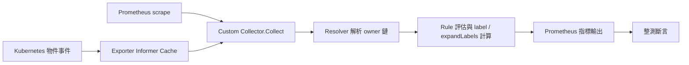

# 整合測試：詳細設計與實作說明

本文件是 `test/integration/` 整合測試的詳細設計文件。
若只需要快速執行方式，請看 [`test/integration/README.md`](../test/integration/README.md)。

## 目標

整合測試使用 Kind 上的真實 Kubernetes API Server，驗證 `metadata-exporter` 的下列行為：

1. 指標輸出的功能正確性（custom collector / scrape-time 模型）。
2. `topController` 關聯鏈解析正確性，含未 watch 父 kind 時的 `onMissing`/`fallbacks` 行為。
3. 在高頻更新下，scrape 端的可觀測性穩定（`exporter_collect_total` 不出現 error，`exporter_anchor_count` 隨 cache 收斂）。
4. watch 拓樸在 **cluster-wide**、**per-namespace**、以及 **`watch.resources[]` 僅子集** 等模式下的可預期性，與 `apiserver_longrunning_requests` 的差分一致。

## 範圍與非目標

測試範圍包含：

- 從 Kubernetes 物件到 Prometheus 指標的端到端驗證。
- watch 連線數在不同拓樸下的差分（delta）驗證。
- 高頻更新下，scrape-time 仍可在 timeout 內穩定產出（不噴 error counter）。

不在此套件範圍：

- 長時間 soak 或記憶體洩漏認證（例如連跑數小時）。
- 多節點**排程策略**、Pod 跨節點遷移與工作負載抖動（整測預設 Kind 已為多節點，僅用於擴充 Node 指標覆蓋與較真實的節點 churn，不驗證排程器行為）。
- 網路故障 / 控制平面中斷的 chaos 驗證。

## 測試架構

### 目錄與責任分工

- [`test/integration/run.sh`](../test/integration/run.sh)：建立或銜接 Kind（[`kind_ensure_cluster.inc.sh`](../test/integration/kind_ensure_cluster.inc.sh) 比對現有同名 cluster 節點數與 [`kind-config.yaml`](../test/integration/kind-config.yaml)，一致則重用，否則刪後重建）、等待節點 Ready、[patch ExternalIP](../test/integration/patch_kind_node_external_ips.sh)、建 image、套 manifests、呼叫 `go test`；可選 `INTEGRATION_PORT_FORWARD_METRICS` 於測試後前景 port-forward。metrics 快照列印由 Go 整測依 `INTEGRATION_PRINT_METRICS` 在各測試結束時輸出（見 `test/integration/README.md`）。
- [`test/integration/kind-config.yaml`](../test/integration/kind-config.yaml)：整測用 Kind 拓樸（預設 1 control-plane + 2 worker）。
- [`test/integration/manifests/configmap.yaml`](../test/integration/manifests/configmap.yaml)：整測用規則與預設 watcher 設定。
- [`test/integration/e2e/e2e_test.go`](../test/integration/e2e/e2e_test.go)：`TestMain` 與 kube client 初始化。
- [`test/integration/e2e/helpers.go`](../test/integration/e2e/helpers.go)：部署、等待、scrape 指標、公用斷言工具。
- [`test/integration/e2e/topology_test.go`](../test/integration/e2e/topology_test.go)：watch 拓樸測試。
- [`test/integration/e2e/correctness_test.go`](../test/integration/e2e/correctness_test.go)：功能正確性測試。
- [`test/integration/e2e/correctness_node_test.go`](../test/integration/e2e/correctness_node_test.go)：Node 相關指標（假 ExternalIP 由 runner patch）。
- [`test/integration/e2e/informer_pending_image_update_test.go`](../test/integration/e2e/informer_pending_image_update_test.go)：informer cache 對 Pod image 變更的可見性。

### 測試資料流

## 觀測面與量測方式

1. `kube-apiserver /metrics`
   - 來源：`kubectl get --raw /metrics`
   - 用途：watch 連線數的權威來源（`apiserver_longrunning_requests`）。
2. exporter `/metrics`
   - 來源：helper 透過 API server proxy 讀 exporter pod 的 metrics。
   - 用途：`it_*`、`exporter_*`、`rest_client_requests_total` 等業務與自監控指標。
3. exporter logs
   - 用途：失敗時快速確認 watch 模式與啟動狀態。

4. （可選）除錯時的 metrics 列印 / port-forward  
   - 設 `INTEGRATION_PRINT_METRICS=1` 時，每支與 metrics 相關的整測在結束時透過 `t.Log` 印出 exporter `/metrics` 中**與該測試相關的指標名稱**（白名單）對應的樣本列，而非整份 exposition。由 Go 測試讀取該 env。`INTEGRATION_PORT_FORWARD_METRICS` 仍由 `run.sh` 在測試後處理。細節見 [`test/integration/README.md`](../test/integration/README.md)。

## 目前測試案例

### Topology 類

- `TestTopology_ClusterWide`
  - 叢集全域 topology（未限定 per-namespace watch）時，各 kind 的 watch delta 預期為 `1`。
- `TestTopology_PerNamespace`
  - 指定 3 個 namespace 時，各 kind watch delta 預期為 `3`。
  - 非監看 namespace 的物件不應出現在 `it_pod_info`。
- `TestTopology_IdleStable`
  - 閒置區間內 watch 連線不應漂移；scrape error 計數（`exporter_collect_total{result="error"}`) 必須為 0。
  - 在 scrape-time 架構下，`exporter_collect_total` 會隨每次 Prometheus scrape 自然推進，故不再以「near-flat」斷言；改以 watch 連線差分 + error counter 為主。
- `TestTopology_KindSubset`
  - `watch.resources[]` 僅含 `Pod`、`Deployment`（`kindSubsetClusterWideConfigYAML`）且 cluster-wide 時，`pods` 與 `deployments` 的 WATCH 差分為 `+1`；`replicasets` / `statefulsets` / `daemonsets` / `nodes` 為 `0`。
  - 規則仍使用 `topController`，未 watch `ReplicaSet` 等父 kind 時，啟動日誌應含 `not all parent kinds are watched`（不阻斷測試斷言）。

### Correctness 類

- `TestCorrectness_FixtureFlow`
  - fixture 生命週期、container label、刪除後 series 回收。
- `TestCorrectness_ControllerAnnotationWithoutPodAnnotation`
  - 確保 annotation 來源是 controller，而非 Pod 自身 metadata。
- `TestCorrectness_NodeMetrics`
  - 對**每個** Node 驗證 API 上同時具備 `InternalIP` 與 `ExternalIP`（後者由 `patch_kind_node_external_ips.sh` 寫入 [RFC 5737](https://datatracker.ietf.org/doc/html/rfc5737) 測試位址），以及 `it_node_info` / `it_node_address` / `it_node_condition`。
- `TestCorrectness_PodDynamicLabelsExpanded`
  - 套用 `dynamicMetadataConfigYAML`，驗證 Pod `metadata.labels` 會被 `expandLabels` 動態展平為 metric labels。
  - 覆蓋特殊字元 key 的 sanitize（例如 `app.kubernetes.io/name` -> `label_app_kubernetes_io_name`）。
- `TestCorrectness_PodDynamicAnnotationsMutation`
  - 驗證 Pod `metadata.annotations` 動態展平後的 mutation 收斂：新增 key 後可見、刪除 key 後不殘留。
  - 並檢查 `exporter_collect_total{result="error"}` 不增加，避免功能正確但 collector 已出錯。
- `TestCorrectness_NodeDynamicMetadataSingleKey`
  - Node 動態 metadata 基礎路徑：1 個 label key + 1 個 annotation key 可正確展平並輸出。
- `TestCorrectness_NodeDynamicMetadataMultiKey`
  - Node 動態 metadata 多 key 路徑：`labels` 與 `annotations` 各至少 2 個 key（含特殊字元）皆可正確展平與對值。

## 需要特別說明的「可浮動 / 可調整」機制

### 1) Scrape error 與 latency 為主要回歸訊號

在 scrape-time 模型下，沒有 reconcile workqueue 與 reverse index 可觀察。整測的核心可觀測訊號為：

- `exporter_collect_total{result="error"}`：應**為 0**，任何增加都是回歸。
- `exporter_collect_duration_seconds_bucket`：scrape-time 評估時間，過大代表 cache 使用或 expandLabels cardinality 失控。
- `exporter_anchor_count{rule, kind}`：反映目前 cache 中該 rule 候選 anchor 數量，刪除後應隨之下降（或至少不再上升）。

### 2) watch 驗證採「差分量測」，不是絕對值

Topology 測試先量 baseline（exporter scale=0），再 scale=1 量 after，最後比 `delta`。  
這是因為 apiserver 指標本身包含系統元件的 watch，直接用絕對值容易誤判。  
有明確的 `watch.resources[]`（或省略時展開為全部支援 kind）時，WATCH 扇出大約是「namespace 段數（cluster-wide 為 1）× **啟用中的 kind 數**」，等同程式內的 `len(namespaces) × len(EffectiveKinds)`（`EffectiveKinds` 定義在 `docs/CONFIG.md` / `pkg/config`）。

### 3) 最終一致性等待（`waitFor + timeout`）是測試設計的一部分

整測大量使用 `waitFor` 與 timeout（例如 15s/45s/60s/90s）等待 rollout 與指標收斂。  
若環境較慢，應先調整等待窗口，而非直接放寬功能斷言。

### 4) Scrape-time 模型不需要等 queue 排空

在 custom collector 模型下，沒有 reconcile workqueue：每次 Prometheus scrape 從 informer cache 即時組裝指標。因此整測「等收斂」改以業務指標自身條件（例如某個 series 的 label/value 已更新）作為 polling 條件，不再以 queue 深度當作前置觀察點。

## 規則與 fixture 設計重點

整測預設規則主要驗證：

- `it_pod_info`：每 Pod 一條 series，含 controller 資訊。
- `it_pod_container_info`：每 `(pod, container)` 一條 series。

其中 `controller_annotation_integration_test_controller_note` 直接以 `source: topController` 取得  
`metadata.annotations["integration.test/controller-note"]`，可用來明確驗證資料來源是 controller 而非 Pod。

預設的 `configmap`／`renderConfigYAML` 在 `kinds` 下列出 **五種** resource，僅對 `Pod` 加 `fieldSelector`（其餘空物件），以維持與舊版「全 kind + Pod 篩選」等價的 topology 與 `topController` 行為。`kind-subset` 專用設定在 `kindSubsetClusterWideConfigYAML`（僅在 `TestTopology_KindSubset` 套用），避免干擾其他以「全量 kind」假設的測試。

## 擴充測試時的建議

1. 優先重用 `helpers.go`，避免重複等待與 scrape 邏輯。
2. 每個 test 使用獨立 namespace/fixture，降低交互干擾。
3. 同時驗證：
   - Kubernetes 物件真值（API 物件是否真的改了）
   - metrics 真值（使用者實際會看到的輸出）
4. 若是來源邊界議題，務必加入負向斷言（例如 Pod 不應有該 annotation）。
5. 若新增比例/閾值型斷言，請在文件中說明其目的、建議調整區間與調整時機。

## 已知限制

- 尚未納入長時間記憶體/協程趨勢追蹤。
- 尚未涵蓋控制平面故障復原情境。
- watch 歸因仍採差分法，不是單 exporter 身分歸因。
- Kind 預設為 [`kind-config.yaml`](../test/integration/kind-config.yaml) 的三節點拓樸；Node `ExternalIP` 為測試用 patch，若 kubelet 覆寫 `status.addresses` 可能影響穩定性（見 `patch_kind_node_external_ips.sh` 註解與 `INTEGRATION_PATCH_NODE_EXTERNAL_IP`）。

## 設定檔（schema）

整合測與 [`docs/CONFIG.md`](../docs/CONFIG.md) 第 4 節一致，使用 `watch.resources[]`（`kind`、`scope`、`namespaces`、`labelSelector`、`fieldSelector`）。變更 exporter 二進位或設定後跑 `make e2e` 前請**重建 exporter image**。YAML 中若出現不在 struct 內的鍵，反序列化時會被忽略，不會由 `Load` 特別報錯。
