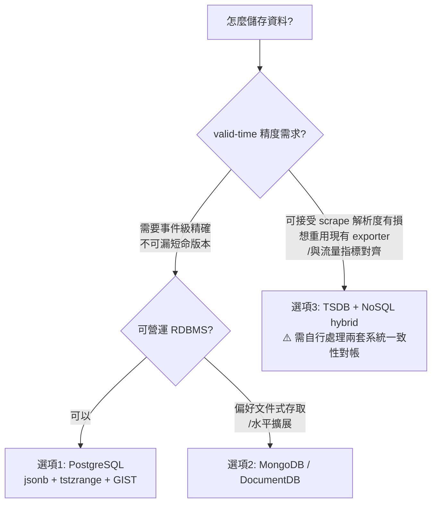
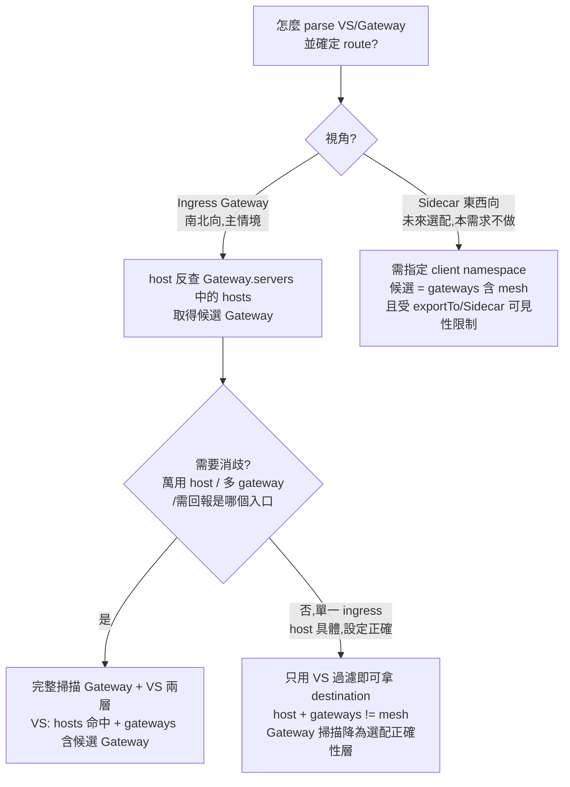
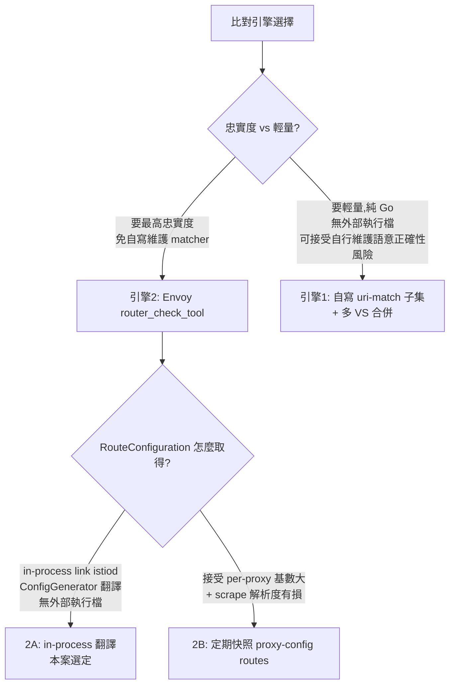
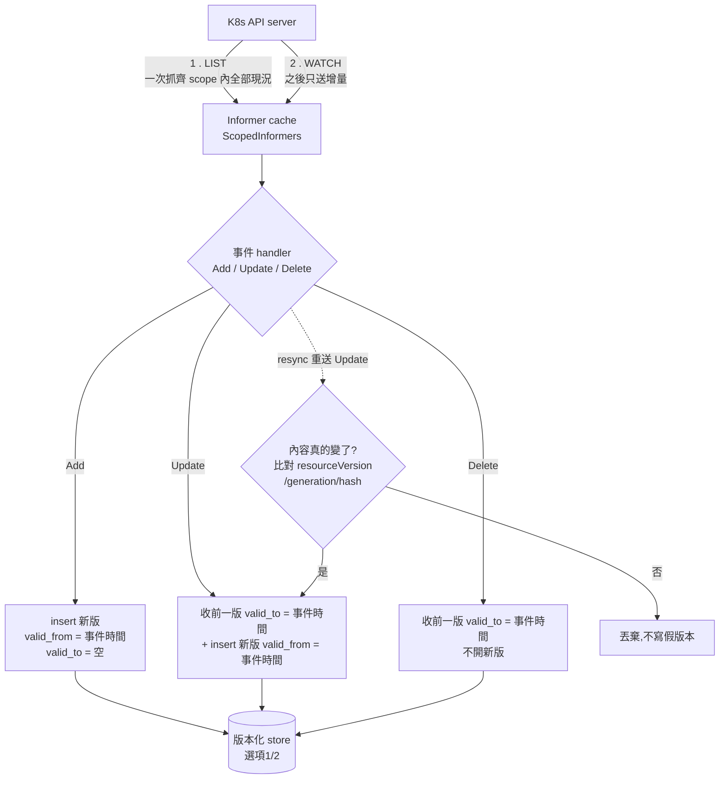
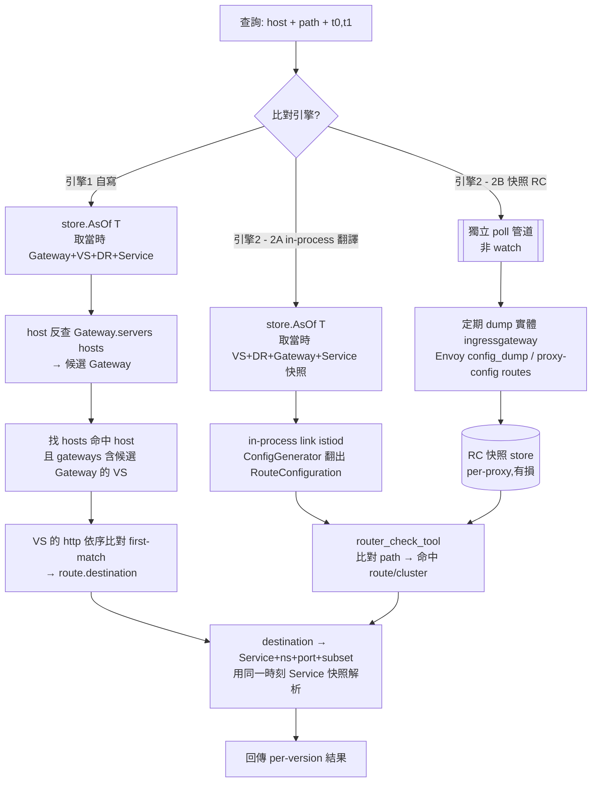

# Istio VirtualService 路由回溯查詢 — 儲存與架構建議

> 狀態：設計討論紀錄（design note）。**「引擎 2A」的解析切片已有可運作 POC（`poc/route2a`）**；其餘（版本化 temporal store、watch/ingest、時間回溯）尚未實作。POC 的落地細節與**與本設計的差異**見後述「[引擎 2A 的 POC 實作現況](#引擎-2a-的-poc-實作現況pocroute2a)」。彙整自一次架構討論，供後續實作與 review 參考。

## Context（為什麼要做這件事）

目標：給定 VirtualService 的 **host**（如 `product.service.com`）、**path**（如 `/api/v1/users`）與**時間區間**（如今天 11:00–12:00），查出該區間內符合的路由規則**依序**解析到哪些 destination（K8s Service + namespace + port）。且若設定在區間內被改過，要**回傳每個版本**；destination 要**完整解析到 Service+port**（含 DestinationRule subset）。

目前本專案是一個 **通用 K8s metadata → Prometheus `_info` gauge exporter**：
- scrape-time 重建，value=1，flat label，**只反映當下狀態**（`pkg/collector/collector.go` 的 `Collect`）。
- 不追蹤 `resourceVersion` / `generation`，**不保留任何歷史**。
- 無 Istio 語意，路由比對/排序完全沒有。

問題核心：使用者想用「export 成 metric → TSDB → 另一支程式 query → parse + 整合 → routing」。本文件評估此格式是否合適，並給出建議。

---

## 評估結論：目前的 TSDB metric export 格式**不適合**當這個需求的真實來源

原因（針對「有序、巢狀、需回溯歷史、需完整解析」這四個特性）：

1. **路由是有序、巢狀、關聯式結構，flat label 會遺失語意。** 一次解析需要：host 清單、`spec.http[]` 的**順序**（first-match-wins）、每條的 `match[]`（uri prefix/exact/regex、method、headers、authority）、以及 route→destination 的權重樹。把 route index / match index / dest index 全塞成 label 既脆弱又難重組。
2. **基數爆炸。** path、host、header-match 當 label → 高基數 series，正是 Prometheus 最不擅長、最吃記憶體的情境。
3. **比對邏輯無法在 PromQL 做。** prefix/exact/regex + 順序優先級這類 matching，PromQL 無法執行；最後一定是把 series 全撈回程式裡自己比對 —— 等於把 TSDB 當成一個很差的 config 快照 KV store。
4. **回溯「每個版本」很難從 metric 還原。** `_info` gauge 雖然「config 存在期間 series 就在」，帶有時間性；但要從一堆碎裂的 series 在時間點 T 正確重組出「當時那一份完整有序設定」、又要偵測 label-set 變化來切出「每個版本」，極為脆弱。
5. **完整解析需要整份巢狀 spec。** 要做 DestinationRule subset、`destination.host` → Service/ns/port，必須保留 VirtualService / DestinationRule / Service / EndpointSlice 的**完整物件**，這無法可靠地塞進 label。

> Metric/TSDB 路線適合「低基數的存在性與聚合可觀測性」，**不適合**「精準回溯某時刻的完整有序設定並重放路由邏輯」。後者需要的是**版本化（bitemporal）的設定快照儲存 + 一個解析引擎**。

---

## 決策樹：關鍵設計分歧點

以下三棵樹是本文件「儲存選型」「視角」「比對引擎」三個小節的決策邏輯視覺化，不引入新結論，僅供快速導覽；細節與取捨理由仍以原文為準。

### 樹 1：怎麼儲存資料

對應「[儲存選型](#儲存選型三個候選store-interface-抽象可換)」與「valid-time 邊界精度」小節。核心分歧是 **valid-time 精度需求** —— 要不要漏掉兩次事件/scrape 之間的短命版本。



### 樹 2：視角收斂（怎麼 parse VS 和 Gateway）

對應「[視角（vantage）](#視角vantage)」小節。核心分歧是**視角**，以及 ingress 視角下要不要完整掃描 Gateway 來消歧。



### 樹 3：比對引擎選擇

對應「[比對引擎](#比對引擎--計畫並列兩條實作時再選)」小節。核心分歧是**忠實度優先（借 Envoy 真正的比對碼）**還是**輕量優先（自寫 matcher）**。



---

## 資料流：從 API server 到路由解析

這節說明「watch 到什麼 → 存成什麼 → 查詢時三條消費路線各吃哪份資料」。關鍵觀念：**只有設定物件（VS/Gateway/DR/Service）在 API server 裡、可被 watch；Envoy 的 RouteConfiguration 不在 API server**，所以走 router_check_tool 的路線資料來源不同（見下）。

### 階段一：擷取（watch → 版本化 store）

watch 的對象是 **`Gateway` CRD**（不是實體 istio-ingressgateway pod —— pod 裡沒有 RouteConfiguration），與 `VirtualService` / `DestinationRule` / `Service` 走完全相同的 list-watch 機制。



擷取階段三個一定要處理的細節（前面討論釐清的）：

- **初始 LIST 的 `valid_from`** 是「watcher 啟動時間」，非資源真正建立時間；要真實時間需讀 `metadata.creationTimestamp`。
- **去重要用 spec-hash（不是只看 resourceVersion 變沒變）**：resourceVersion 是「**任何一次 etcd 寫入**都會變」，不只 spec。即使限縮在 VS/Gateway/Service，仍有**非 spec 的 bump 來源**：istiod 寫 VS/Gateway 的 reconciliation **status**（依 feature flag）、`type: LoadBalancer` Service 的 `status.loadBalancer`、server-side apply 的 `managedFields`、GitOps 改到 annotation。（真正 no-op 的 apply 算出無 diff 不會寫，故乾淨 re-apply 不 bump。）另外 informer 週期 **resync** 會重送 Update。因此判「是不是新的一版」要**比對 spec-hash（或 generation）**：resourceVersion 變了但 spec-hash 沒變 → 不開新版本，只是雜訊。
- **版本身分用 resourceVersion（比 generation 抗撞）**：對同一資源，resourceVersion 底層是 etcd 全域 revision、**嚴格遞增、絕不重複**，且**刪除後重建不會重用**（重建拿更大的新值）——這正是它比 `generation` 好的地方：generation 刪除重建會歸 1 撞號，resourceVersion 不會。唯一的重複/倒退角落是 **etcd 從備份還原/遷移**（罕見維運事件）；要連這個都滴水不漏，record 再加 `metadata.uid`（順便乾淨區隔重建前後兩段生命）即可，非必需。
- **跨 namespace 綁定**：VS 的 `spec.gateways` 可寫 `其他ns/gateway-name`，而 ingress 的 Gateway 常在 `istio-system`；watch scope 若只含 app namespace 會漏掉被引用的 Gateway，導致查詢時 host→Gateway 反查斷掉。

### 階段二：查詢（store → 三條消費路線）

輸入 `host + path + [t0,t1]`。**注意三條路線吃的資料來源不同** —— 自寫邏輯與 2A 直接吃階段一的 store；2B 是**另一條完全獨立的 poll 管道**，繞過 watch。



三條路線的資料來源對照：

| 路線 | RouteConfiguration 來源 | 是否重用 watch+store | 時間精度 |
|---|---|---|---|
| **引擎1 自寫** | 不需要 RC，直接用 VS spec 自己比對 | ✅ 完全靠 watch+store | 事件級精確 |
| **引擎2 / 2A** | store 取當時 spec 快照 → in-process istiod ConfigGenerator 翻譯 | ✅ 靠 watch+store（多一步翻譯） | 事件級精確 |
| **引擎2 / 2B** | 直接 poll 實體 gateway 的 Envoy config | ❌ 繞過 watch，另一條 poll 管道 | scrape 解析度有損、per-proxy |

> 收斂：**watch+store（階段一）直接餵「引擎1」與「2A」；只有「2B」是獨立的 config poll 管道**。三條路線最後都匯到同一步 destination 解析（`destination.host` → Service+ns+port+subset），差別只在「怎麼從 path 命中 route」與「RC 從哪來」。

---

## 建議架構

分三塊。**重用既有 watcher 基礎建設**，但把「scrape-time 重算」改成「事件驅動持久化」。

### A. 事件式擷取 → 版本化快照（temporal store）

- **重用** `pkg/collector/listers.go` 的 `ScopedInformers`（已能對任意 GVR 從 informer cache watch）與 `pkg/config/config.go` 的 `WatchResource` GVR 設定。
- **新增 informer 的事件 handler**（`AddFunc/UpdateFunc/DeleteFunc`）—— 現行 collector 是純 scrape-time，**沒有**這層，這是真正要補的核心。每個事件寫一筆版本記錄：

  ```
  { gvk, namespace, name, resourceVersion, generation,
    valid_from(事件時間), valid_to(下一版到來或刪除時填入),
    object_json(完整物件) }
  ```

  這是 append-only 的 bitemporal log；`valid_to` 在下一版本到來或刪除時補上。
- **要 watch 的 GVR**：`VirtualService`、`Gateway`（ingress 視角由 host 反查、必需）、`DestinationRule`（subset→labels）、`Service`（host→svc+port）、`EndpointSlice`（subset→實際 endpoint，選配）；`Sidecar`（僅 sidecar 視角未來才需要）。

#### 資源分層：哪些進版本化 store、哪些留 TSDB

判準是**「查詢時要不要逐一看該資源的 spec 內容」**（有內容比對/順序 → 版本化 store；只是身分/selector 查找、低基數扁平 → 留既有 TSDB 匯出即可）。

| 資源 | 放哪 | 為什麼 |
|---|---|---|
| **VirtualService** | 版本化 store（全 spec） | 逐條看 `http[]`、**有順序**（first-match）、要 path 比對 |
| **Gateway** | 版本化 store（全 spec） | 看 `servers.hosts`（含萬用）+ `selector` + `port`；**非順序**，是內容比對（host 綁定/vantage） |
| **DestinationRule** | 版本化 store（全 spec，**條件式**） | subset→pod label 只存在 DR；要解析到 subset/pod 才需要，純 Service 導流可略 |
| **Service** | **可留 TSDB 模式** | 不在關鍵路徑（見下）；只做 named-port / selector 查找，低基數扁平、少變 |
| **EndpointSlice / pod** | 當下 / best-effort | endpoint 層、高易變，歷史精確本就困難 |

**為什麼 Service 不在關鍵路徑**：「host+path → Service+ns+port」這個答案**光靠 VirtualService 就出來**——`route.destination.host` 就是 Service FQDN、`destination.port.number` 就是 port。Service / EndpointSlice 只在要**再往下走到 pod**（或解析 named port、驗證 Service 存在）時才用到；那是身分/selector 查找、無順序。

> ⚠️ **時間精度接縫**：VS/GW/DR 走事件級精確 store、Service 走 scrape 解析度 TSDB，代表 join「時刻 T 的 Service」時混了兩種時間精度。因 Service 的 spec 很穩定（port rename 罕見），此接縫實務上可接受，但心裡要有數；若要求 Service 也事件級精確，就把它一起放進版本化 store。

#### 儲存選型：三個候選（store interface 抽象，可換）

writer 與 query 都只依賴一個 `Store` interface（`Put(version, validFrom, spec)` / `SetValidTo` / `AsOf(gvk,ns,name,T)` / `Overlap(gvk,ns,name,t0,t1)`），底層三選一：

**選項 1：PostgreSQL（jsonb + `tstzrange` + GIST）**
- 執行方式：一張表 `config_versions(gvk, ns, name, generation, validity tstzrange, spec jsonb)`，GIST index on `validity`。writer 每次變更插一列並把前一列 `validity` 上界補上；query 用 `validity && tstzrange(t0,t1)` 一句撈出區間內全部版本。
- 優點：單一存儲；valid-time **精確**且交易式（writer 一次 tx 寫新列+收前列，無一致性縫）；range/overlap 是原生能力；同表可一併存 DR/Service。
- **為什麼「無一致性縫」**：每次變更要同時做「收前一版 `valid_to` + 插新版」兩件事；Postgres 的**多語句 ACID 交易是預設能力**，兩步包在一個 `BEGIN…COMMIT`，對讀者要嘛全發生要嘛全沒有，永遠看不到「兩版同時開放」的中間態。更進一步可加 **GIST exclusion constraint**（`EXCLUDE ... WITH &&`），由 DB 本身**禁止**同一 `(gvk,ns,name)` 出現重疊區間——正確性由 schema 約束保證，不只靠 app 自律。
- 缺點：要營運一個 RDBMS；spec 很大時 jsonb 體積與索引成本上升。

**選項 2：MongoDB / DocumentDB（單一文件存儲）**
- 執行方式：collection `config_versions`，文件 `{gvk, ns, name, generation, validFrom, validTo, spec}`，複合索引 `(gvk,ns,name,validFrom)`。writer 插入新文件、把前一文件 `validTo` 設為事件時間；query 用 `validFrom <= t1 AND (validTo == null OR validTo >= t0)` 撈區間版本。
- 優點：單一存儲；spec 是巢狀 JSON，存取最自然、可對 spec 欄位直接查；水平擴展容易。
- 缺點：valid-time 用兩個欄位自管（無 range 型別）；「插新+收前」是兩個寫入，需注意原子性（可用 transaction 或讓 query 端容忍短暫重疊）。
- **為什麼「要注意原子性」**：Mongo **單一文件**寫入才原子，但「收舊 doc + 插新 doc」跨**兩個文件**，預設非單一原子操作——兩次寫入間有小視窗，讀者可能看到「舊 doc 還開放 + 新 doc 也開放」的重疊（此即選項 1 用交易關掉的那道「縫」）。Mongo 4.0+ 有多文件交易可消除它，但屬**顯式 opt-in**（需 replica set、有成本），非單文件那套最自然用法；且無 range 型別/exclusion constraint，沒有 schema 層防重疊護欄。

**選項 3：TSDB + NoSQL hybrid（重用現有 exporter）**
- 執行方式：TSDB 存**低基數版本索引指標** `vs_version{namespace,name,uid,generation}=1`；NoSQL（DynamoDB / Mongo / 物件儲存）以**同一把 join key `(uid, generation)`** 存**完整 spec**。query：先對 TSDB 在 `[t0,t1]` 查出現過的 `(uid,generation)` 集合（`last_over_time`/staleness 還原存在區間），再用**同一把 key** 去 NoSQL 撈規則。
- 優點：**直接重用現有 scrape-time exporter** 產生版本指標；版本時間軸可在 Grafana 與流量/延遲指標**對齊**；NoSQL 端只是 immutable KV，極單純。
- 缺點：valid-time **受限於 scrape interval**（見下節，兩 scrape 間的短命版本會漏）；**兩套系統一致性**（TSDB 有但 NoSQL 無 / 反之）需對帳；從 presence 指標還原區間的 PromQL 較 fiddly。
- **關鍵約束：TSDB label 必須 == NoSQL join key**（TSDB 只告訴你「哪幾版存在過」，要用同一把 key 回 NoSQL 撈 spec）。所以不能一邊 generation、一邊 resourceVersion——**對不起來**。挑 join key 有兩個要求：**低 churn**（否則 series 爆炸）+ **抗撞**（跨刪除重建不撞）。
  - `resourceVersion` **不能當 label**：每次 etcd 寫入（含 status/managedFields 等非 spec 寫入）都變 → 基數爆炸。它抗撞，但 churn 太兇，不適合 join key。
  - `generation` 單獨也不行：低 churn（只 spec 改才 +1），但**刪除重建歸 1 會撞號**。
  - **正解：join key = `(uid, generation)`，兩邊都用**。`uid` 補掉 generation 的重建撞號、且**低 churn**（uid 只在重建變、generation 只在 spec 變，都不受 status/managedFields 影響）→ 同時滿足低 churn + 抗撞，又能 TSDB↔NoSQL 對得起來。
  - `resourceVersion` 則存進 NoSQL doc **當 provenance**（精確溯源用），**不參與 join**。
  - 註：選項 1/2 是事件驅動、writer 自控身分、沒有「label==key」約束，那裡用 `resourceVersion + spec-hash`（見「資料流」去重段）才是最抗撞的做法；此 `(uid, generation)` 的取捨是**選項 3 特有**，因為 label 由 scrape-time exporter 產生、被迫要低 churn。

> 三者都滿足「回傳每個版本 + 完整解析」；差別在 valid-time 精度（選項 3 有損）與運維面（選項 3 重用既有、但多一套一致性負擔）。

> **時間區間查詢速度（選項 1 vs 2）**：
> - **窄查詢**（已鎖定 `(gvk,ns,name)`，查該物件在 `[t0,t1]` 的版本，＝本案主情境）→ **兩者差不多**。Mongo 複合索引 `(gvk,ns,name,validFrom)` 先縮到單一物件的少數幾版，殘留 `validTo` filter 幾乎無成本；Postgres 同樣秒回。此情境選型應由上面的**正確性/運維**決定，而非速度。
> - **廣查詢**（跨很多物件，「區間內變動過的所有資源」）→ **Postgres 較快且較自然**。`validity && tstzrange(t0,t1)` 由 **GIST range-overlap** 一次探測搞定；Mongo 的 `validFrom<=t1 AND validTo>=t0` 是**兩個獨立欄位各一範圍**，B-tree 只能有效吃一側、另一側淪為殘留 filter，選擇性差。

#### valid-time 邊界精度：兩種做法都規劃

| 做法 | 怎麼做 | 優點 | 缺點 |
|---|---|---|---|
| **A. 事件級精確（推薦，選項 1/2）** | informer Add/Update/Delete handler 在**每次變更**寫 `validFrom=事件時間`、收前一版 `validTo` | 不漏任何版本、邊界精確到變更發生當下 | 需要事件驅動 writer（現行 collector 沒有，要新增） |
| **B. scrape 解析度（選項 3）** | 沿用 scrape-time exporter，版本存在性由 `vs_version` 指標在各 scrape 時點呈現 | 重用現有匯出、零新增 writer、可與流量指標對齊 | ±scrape interval 模糊；兩次 scrape 間改了又回的短命版本會**整段漏掉** |

> 注意：選項 3 雖用 scrape 當時間索引，但「version→完整 spec」仍須有人寫進 NoSQL；若那個 writer 是事件驅動的，它其實也能順手記 validFrom/validTo，這時 TSDB 索引就退化為「對齊用的 observability 層」而非必要。

#### Config 怎麼寫（純加法，TSDB export 不移除）

informer 由 `watch.resources` 單一來源驅動（`pkg/config/config.go` 的 `Watch`），exporter 的 `rules` 與歷史快照都只是同一批 informer 的不同消費者。因此：

- `metricPrefix` / `watch.resources` / `rules` 全部**保留不動**（TSDB export 行為不變）。
- `watch.resources` **新增** Istio CRD（要寫完整 GVR，因非內建 kind）+ `Service` / `EndpointSlice`（內建 legacy kind）。
- **新增** 頂層 `history:` 區塊（opt-in）：`enabled` / `store{type,dsn}` / `resources`（須是 `watch.resources` 子集）。`enabled:false` 或省略 → 行為與今天完全相同。

```yaml
watch:
  resources:
    - kind: Pod                # 既有,TSDB export 照用
    - name: VirtualService     # 新增
      apiVersion: networking.istio.io/v1beta1
      kind: VirtualService
      resource: virtualservices
      scope: Namespaced
    - name: DestinationRule
      apiVersion: networking.istio.io/v1beta1
      kind: DestinationRule
      resource: destinationrules
      scope: Namespaced
    - kind: Service            # 內建
    - kind: EndpointSlice      # 內建
rules: [ ... ]                 # 既有 Prometheus 規則,完全不動
history:                       # 新增
  enabled: true
  store:                       # type 三選一,見「儲存選型」
    type: postgres             # postgres | mongo | hybrid
    dsn: "postgres://...:5432/db"
    # mongo:  uri / database
    # hybrid: nosql{...} + 版本指標走既有 rules/exporter
  resources: [VirtualService, DestinationRule, Service, EndpointSlice]
```

> ⚠️ 現行 `config.Validate()` 強制 `len(rules) >= 1`。保留既有 export rules 即無影響；若日後要「只跑歷史」才需放寬此檢查。

### B. 查詢／路由解析引擎（即使用者設想的「另一支程式」）

輸入：`host`、`path`、（選配 method/headers）、時間區間 `[t0,t1]`。**視角預設為 ingress gateway，由 host 反查 `Gateway` 資源推導**（非使用者參數）；sidecar 視角為未來選配，才需帶 client namespace。

通用流程：

1. 撈出 validity 與 `[t0,t1]` **重疊**的所有相關版本（VS/DR/Service/Gateway/Sidecar），依各資源 `valid_from` 切成數個區段 → 對應「每個版本」。
2. 依**視角**收斂候選 VS 並合併（見下方「視角」與「比對引擎」）。
3. 對每個版本做 path → route 比對，取出該條 `route[].destination`（含 weight）有序清單。
4. 對每個 destination，用**同一時刻生效**的 Service 快照解析 `destination.host` → Service+namespace+port（短名→同 ns service；FQDN→`svc.ns`；port 為號碼或名稱）；套用 DestinationRule subset（labels），需要 endpoint 層級再對 EndpointSlice。
5. 回傳 per-version：`[valid_from, valid_to, vantage, matched_route, [{service, namespace, port, subset, weight}...]]`。

#### 視角（vantage）

同一 host+path 從不同視角可能命中不同 route，因為 istiod 是**逐 proxy** 算 RouteConfiguration 的。

**主情境 = Ingress Gateway（南北向），且 vantage 由 host 推導、非使用者參數：**

```
1. 掃全 cluster 的 Gateway,找 servers[].hosts 命中 host 的 → 候選 Gateway(+其 selector 指向的實體 ingress)
2. 掃全 cluster 的 VirtualService,取 spec.hosts 命中 host 且 spec.gateways 含步驟1的 Gateway 者
   （注意:spec.gateways 省略 = ["mesh"],不套用 ingress → 排除）
3. 這些 VS 的 http[] 依序比對 path → 命中 route
4. route.destination.host → K8s Service+ns+port
```

- 通常一個外部 host 只被一個 Gateway 服務 → 單一結果；若被多個 Gateway 服務（對外/對內兩套、`*.service.com` 萬用）→ 每個 gateway 各回一個結果（故 vantage 仍是可枚舉維度）。
- **Gateway 掃描是「正確性/消歧層」，非拿 destination 的必要條件**：route→destination 規則全在 VS，單一 ingress、host 具體、設定正確的乖乖牌叢集，只用 VS（host + `spec.gateways != [mesh]` 過濾）即可拿到 destination。Gateway 用來（a）驗證綁定真的成立、（b）處理萬用 host、（c）多 gateway 消歧、（d）回報是哪個 gateway/實體 ingress。

**Sidecar（東西向）視角 — 降為選配/未來：** 候選 = `spec.gateways` 含 `mesh`、且對 client namespace 可見（`exportTo` / `Sidecar` import）的 VS，需指定 client namespace。目前需求只做 ingress，可先不實作。

#### 比對引擎 — 計畫並列兩條，實作時再選

**引擎 1：自寫 uri-match 子集（輕量）**

| 能力 | Istio 現成？ | 做法 |
|---|---|---|
| typed struct（VS/DR） | ✅ | `istio.io/api` + `istio.io/client-go` |
| 多 VS 合併（含 delegate、跨 VS 順序、單一 catch-all 限制） | ⚠️ istiod 內部 | `pilot/pkg/model` 有但屬 internal、依賴重、版本會變；**自行實作合併規則**或謹慎移植 |
| path → route 命中 | ❌ 控制面沒有 | 自行實作 `http[]` first-match + prefix/exact/regex（RE2）+ method/headers/authority |

- 優：無外部執行檔、純 Go、快、易測試。缺：須**忠實複製** Istio/Envoy 的比對與優先級語意，有 subtle bug 風險。

**引擎 2：Envoy 忠實度（借 Envoy 真正的比對碼）**

不自己寫 matcher，改用 **Envoy `router_check_tool`**（離線二進位，吃 `RouteConfiguration` + 一組 path 測試，回命中的 route/cluster；**不需跑 Envoy、無流量**）。取得 RouteConfiguration 兩種子路線：

- **2A（本案選定）：in-process link istiod 的 ConfigGenerator 翻譯** — 對某時刻的 VS+DR+Gateway+Sidecar+Service 快照，在**同一個 Go process 內**直接呼叫 istiod 的 `ConfigGenerator`（`pilot/pkg/networking/core`），對指定 synthetic proxy（對應視角）build 出 xDS RC。**不起外部進程、不開網路連線**。詳細作法見下節「引擎 2A 詳解」。代價：直接 link istiod internal package，依賴重、跟 istiod 版本強耦合。
- **2B：直接快照 RouteConfiguration** — 不（只）存 VS，改定期 `istioctl proxy-config routes <gateway/pod> -o json` 把**每個 proxy 的 RC** 存進 store（per-proxy = 天然帶視角）。query 時只跑 `router_check_tool`。代價：RC per-proxy 基數大、且 dump 是 **scrape 解析度有損**。

> **已否決：2A-重（外部 `pilot-discovery` file/fake registry 模式 + ADS gRPC）**。原本並列一條「把 `pilot-discovery` 當外部二進位跑、以 synthetic proxy 身分開 ADS 串流收 LDS/RDS」的重量級子路線；因為要離線重建整個翻譯環境（起 process、管 gRPC 生命週期、對每次查詢重跑），營運與延遲成本明顯高於 in-process link，且忠實度與 2A-輕**相同**（同一份 ConfigGenerator 邏輯），故移除，確定走 in-process。

- 優：等於線上 Envoy 行為，免自寫/維護 matcher。**命中結果是 Envoy cluster 名（格式 `outbound|PORT|SUBSET|SERVICE.NS.svc.cluster.local`），已編碼 Service+ns+port+subset → 步驟 4 destination 解析幾乎免費**。缺：2A 直接 link istiod internal package、跟 istiod 版本強耦合；2B 大且有損（per-proxy + scrape）。

> 取捨：要最高忠實度走引擎 2；要輕量走引擎 1。兩者共用步驟 1/4/5（store 查詢與 destination 解析），只差「step 2/3 怎麼比對」。
> `istioctl x describe` / `proxy-config routes` 是 CLI、只反映當下，僅適合 live 驗證或引擎 2B 的 dump 來源，不適合直接當歷史查詢 API。

#### 引擎 2A 詳解：VS+Gateway+DR+Service → RouteConfiguration → `router_check_tool` → Service

上面把 2A 濃縮成一句「in-process link istiod ConfigGenerator 翻譯」。這裡展開成可執行細節，分兩段：(1) 怎麼翻出 `RouteConfiguration`；(2) 怎麼對 `host+path` 跑 `router_check_tool` 拿到目標 Service。先給名詞解釋。

> ⚠️ 本節為**原始設計方案**。實際 POC（`poc/route2a`）在幾個地方做了不同的落地選擇（不用 `FakeDiscoveryServer`、略過 `BuildListeners` 兩跳、`router_check_tool` 需 sentinel 技巧等）——差異逐項見「[引擎 2A 的 POC 實作現況](#引擎-2a-的-poc-實作現況pocroute2a)」。

**名詞解釋（xDS 家族與相關元件）**

| 名詞 | 全名 / 是什麼 | 解釋 |
|---|---|---|
| **xDS** | *x Discovery Service* | Envoy 的一整族「動態設定 API」總稱，`x` 是佔位符。Envoy 不把設定寫死，而是連到管理伺服器（Istio 裡就是 istiod）**動態拉設定**。LDS/RDS/CDS/EDS 都是它的成員。 |
| **LDS** | *Listener Discovery Service* | 遞送 **Listener**（監聽器）：綁 port/address、定義收到連線後套哪條 filter chain。HTTP Listener 內的 connection manager 會**引用一份 RouteConfiguration**。 |
| **RDS** | *Route Discovery Service* | 遞送 **RouteConfiguration**——本案要的東西。內容是 `virtual_hosts[]`（用 `:authority`/host 比對）底下的 `routes[]`（用 path/header/method 比對），每條指向一個 cluster。 |
| **CDS** | *Cluster Discovery Service* | 遞送 **Cluster**（後端池）。istiod 把每個 `(Service, port, subset)` 翻成一個 cluster，名字 `outbound|PORT|SUBSET|SERVICE.NS.svc.cluster.local`。 |
| **EDS** | *Endpoint Discovery Service* | 遞送每個 cluster 的實際 **endpoint**（pod IP 清單）。 |
| **ADS** | *Aggregated Discovery Service* | 把 LDS/RDS/CDS/EDS **合併到單一 gRPC 串流**、依相依順序遞送，避免設定不一致。istiod 對外提供 ADS；「拉某 proxy 的完整設定」＝跟 istiod 開一條 ADS 連線。 |
| **synthetic proxy** | 合成的 proxy 身分（`model.Proxy`） | Envoy 連 istiod 時用一個 **node 身分**自報家門（type=router/sidecar、namespace、labels…），istiod **逐 node 算**設定。synthetic proxy ＝ 你**捏一個假 node 身分**（沒有真 Envoy 在跑），叫 istiod「當作在幫這顆 ingress gateway 算」，就拿到那個 gateway 視角的 RC。程式上填 `Type=Router` + 候選 Gateway 的 namespace/labels。 |
| **PushContext** | `model.PushContext` | istiod 一次推送用的**設定＋服務快照**，由 config store（VS/Gateway/DR）與 service registry（Service）建出，是翻譯的輸入上下文。 |
| **ConfigGenerator** | `pilot/pkg/networking/core` | istiod 真正做 `config + proxy + PushContext → xDS 資源` 翻譯的元件，**VS→RouteConfiguration 的邏輯就在這裡**。 |
| **pilot-discovery** | istiod 主二進位 | 平常連 kube-apiserver；也支援 **file/fake registry 模式**（吃檔案而非真 cluster），可離線翻譯。 |
| **router_check_tool** | Envoy 附的離線測試二進位 | 載入一份 RouteConfiguration，用 **Envoy 真正的 route matching 碼**對測試案例比對，回命中的 route/cluster；**不跑 Envoy、無流量、無 istiod**。 |

**步驟一：翻出 RouteConfiguration（in-process，本案唯一路線）**

前提：`VS→RouteConfiguration` 是 istiod ConfigGenerator 做的，自己翻不了；要忠實只能借它。作法是**在查詢程式的同一個 Go process 內，直接 link istiod 的 Go package** 呼叫 `ConfigGenerator`——不起外部進程、不開網路連線、不跑 ADS gRPC。這是 Istio 單元測試自己在用的路徑（參考 `pilot/pkg/xds` 的 `FakeDiscoveryServer`）。

要備齊的 component：**config store 快照**（VS+Gateway+**DR**+Service）、**service registry / PushContext**（istiod 要知道有哪些 Service 才能建 cluster）、**ConfigGenerator**、**synthetic proxy**。

**主要用到的 package**

| package | 用途 |
|---|---|
| `istio.io/istio/pkg/config` + `.../config/schema/collections` | 把 store 撈回的 spec 包成 istiod 認得的 `config.Config` |
| `istio.io/istio/pilot/pkg/model` | `Proxy`、`PushContext`、`Environment`、`IstioConfigStore` 等核心型別 |
| `istio.io/istio/pilot/pkg/networking/core` | `ConfigGenerator`——`VS→RouteConfiguration` 翻譯就在這 |
| `istio.io/istio/pilot/pkg/xds`（選配） | `FakeDiscoveryServer` 測試工具，把下面 4 步全包好，直接 `s.Routes(proxy)` 拿 RC |

**細步驟**

1. **取快照並轉成 istiod config。** `store.AsOf(T)` 取時刻 T 的 `VS + Gateway + DR`（＋條件式 `Sidecar`/`ServiceEntry`）以及 `Service` 快照。把 VS/Gateway/DR 每筆 spec 轉成 `config.Config`（帶對的 `GroupVersionKind`、`Namespace`、`Name`、`CreationTimestamp`）；`Service` 轉成 istiod 的 `*model.Service`（或灌進 fake kube client 讓內建 registry 讀）。

2. **建 config store 與 service registry。** 用 in-memory config store（`memory.Make(collections.Pilot)` → `crdclient`/`model.MakeIstioStore` 之類）把上一步的 configs 灌進去；service registry 用 memory registry 或 fake kube registry 提供 `Service`。兩者組成一個 `model.Environment`（`env.ConfigStore = ...`、`env.ServiceDiscovery = ...`）。

3. **建 PushContext。** `pc := model.NewPushContext(); pc.InitContext(env, nil, nil)`。`InitContext` 會把 VS/Gateway/DR 依 namespace 與 gateway 綁定索引好、把 Service 整理成 cluster 候選——這是翻譯的輸入上下文（`env.PushContext = pc`）。

4. **建 synthetic proxy 並綁定視角。** 對應 ingress gateway 視角：
   ```go
   proxy := &model.Proxy{
       Type:            model.Router,                 // ingress gateway = Router
       ConfigNamespace: candidateGateway.Namespace,   // 候選 Gateway 所在 ns
       Metadata: &model.NodeMetadata{
           Labels: candidateGateway.Spec.Selector,     // 要對得上 Gateway 的 selector
       },
       IstioVersion: parsedIstioVersion,
   }
   proxy.SetGatewaysForProxy(pc)   // 依 selector 把該 proxy 綁到候選 Gateway
   proxy.SetSidecarScope(pc)       // 收斂該 proxy 可見的 VS/DR
   ```
   這兩個 `Set...` 呼叫就是「視角收斂」在 istiod 內的實作——等於前面「視角」小節手動做的 host→Gateway→VS 收斂，但用的是 istiod 原碼，語意保證一致。

5. **呼叫 ConfigGenerator 翻出 RC。** RouteConfiguration 通常是被 Listener 用 **RDS 名字**引用、非 inline，所以是兩跳：
   ```go
   cg := core.NewConfigGenerator(nil)            // cache 可傳 nil
   listeners := cg.BuildListeners(proxy, pc)     // 先 build LDS
   routeNames := extractRDSNames(listeners)      // 從 HCM 的 Rds.RouteConfigName 收集名字
   routes, _ := cg.BuildHTTPRoutes(proxy, pc, routeNames)  // 再 build 出 []*route.RouteConfiguration
   ```
   `routes` 就是要餵給 `router_check_tool` 的 RC。若用 `FakeDiscoveryServer`，上面 2–5 步等同一行 `routes := s.Routes(proxy)`。

6. **版本對齊（強耦合，必須管）。** 翻譯邏輯跨 Istio 版本會變。因為是 link Go package，**query binary 相依的 `istio.io/istio` 版本就決定了翻譯行為**——要忠實還原時刻 T 的結果，query binary 的 istiod 版本應**釘到當時線上叢集的 istiod 版本**；叢集升級 istiod → query binary 要重新 vendor 對應版本並重建。這是 in-process 路線最主要的維運成本（換走 2A-重也躲不掉，因為忠實度本來就綁在 istiod 版本上）。

> DR 為條件式必要：DestinationRule 只有在 route 引用 `subset` 時才必要——subset→pod label 的對應**只存在於 DR**；純 Service 導流（route 不帶 subset）可以沒有 DR。但查詢前不知哪條 route 用 subset，故仍照樣 watch/存 DR、翻譯時一併餵入。

**步驟二：對 host+path 跑 `router_check_tool` 拿目標 Service**

```
輸入1：RouteConfiguration（步驟一翻出來的）
輸入2：測試案例
        :authority = host    # Envoy 用 virtual_hosts[].domains 比對
        :path      = path    # 命中的 virtual_host 內,routes[] 依序比對(first-match)
        (:method / headers 選配)
輸出： 命中的 route → cluster 名
```

1. 把步驟一的 RC 存成 `router_check_tool` 吃的格式。
2. 用查詢輸入組一筆測試案例（`:authority`=host、`:path`=path，有條件就帶 method/header）。
3. 跑 `router_check_tool` → 得命中 **cluster 名** `outbound|PORT|SUBSET|SERVICE.NS.svc.cluster.local`。
4. **解析 cluster 名**（幾乎免費，見 Q8）：已編碼 `Service+namespace+port+subset`，直接切字串即得目標 Service。無 subset 時 SUBSET 欄位為空：`outbound|9080||reviews.ns.svc.cluster.local`。
5. （選配）需要 endpoint 層級再對同一時刻 `EndpointSlice` 快照。

**端到端（2A 全流程）**

```
1. store.AsOf(T) 取當時 VS + Gateway + DR + Service 快照
2. 灌進 config store + service registry;合成對應 ingress gateway 視角的 synthetic proxy
3. in-process link istiod ConfigGenerator 翻出該 proxy 的 RouteConfiguration（BuildListeners → 收 RDS 名字 → BuildHTTPRoutes）
4. RouteConfiguration + 測試案例(:authority=host, :path=path) → router_check_tool
5. 得 cluster 名 → 解析出 Service + ns + port + subset
6.（選配）對 EndpointSlice 快照解到實際 endpoint
```

### 引擎 2A 的 POC 實作現況（`poc/route2a`）

> 狀態：**引擎 2A 的解析切片已有可運作 POC**（`poc/route2a`，獨立 Go module）。它落地了「VS+Gateway+Service → RouteConfiguration → `router_check_tool` → cluster(Service)」這條路徑與 host→Gateway 視角收斂，並附一個 600 gateway × 100 VS 的壓力/正確性測試。**尚未**實作 A（版本化 temporal store）、watch/ingest、時間回溯——POC 直接吃記憶體內、per-gateway 的 scoped 設定，不接 store。

**POC 元件對照本設計：**

| `poc/route2a` 元件 | 對應本文件概念 |
|---|---|
| `internal/gwresolve`（`Resolver.Resolve`） | 「視角」小節的 host→Gateway 反查，most-specific wildcard 消歧 |
| `internal/translate`（`Translator.Translate`） | 引擎 2A 步驟一：in-process ConfigGenerator 翻 `RouteConfiguration` |
| `internal/matchcheck`（`Runner.Resolve`） | 引擎 2A 步驟二：`router_check_tool` 比對 → cluster |
| `internal/simulate`（`Engine.ResolveAll`） | 串起步驟 1→4 的解析引擎（對應「### B. 查詢／路由解析引擎」） |
| `internal/rccache` | 每 gateway 的 `RouteConfiguration` 快取（見下方差異 3） |
| `internal/scalegen` | 測試語料 + by-construction oracle（測試鷹架，非架構本體） |
| `internal/report` | 延遲/吞吐量測 |

**與本設計原文的重要差異（實作時的修正）：**

1. **不使用 `FakeDiscoveryServer`（避免 goroutine leak）。** 原文步驟一/五建議用 `FakeDiscoveryServer` 一行 `s.Routes(proxy)` 包掉環境建置；但它（及 `core.NewConfigGenTest`）會把 stop channel 綁到測試生命週期並**啟兩條長駐 goroutine**，在「每次查詢翻一次」的迴圈裡會累積成 goroutine/記憶體洩漏。POC 改為**手工靜態組出最小 `model.Environment`**（memory config store + memory service registry，`buildScopedEnv`），翻完即丟、無 goroutine、可並發重用同一個 `Translator`。（`RoutesForScoped` 這個 `FakeDiscoveryServer` 風格的 helper 仍保留，但**只當測試 oracle** 用來反證 `Translator.Translate` 正確，非生產路徑。）

2. **翻譯只呼叫一次 `BuildHTTPRoutes`、用固定 route config 名 `http.80`，略過 `BuildListeners`→抽 RDS 名的兩跳。** 原文步驟五示範 `BuildListeners → extractRDSNames → BuildHTTPRoutes`；POC 針對「HTTP :80 ingress gateway」這個固定情境，直接 `configGen.BuildHTTPRoutes(proxy, &model.PushRequest{Push: pc}, []string{"http.80"})`（`http.80` 是 istiod 對 HTTP:80 gateway RC 的固定命名）。若未來要支援多 port / HTTPS / 任意 listener，才需回到 LDS→RDS 動態收名。

3. **多一層 per-gateway `RouteConfiguration` 快取（`rccache`）。** 原文步驟一每次查詢都重翻；POC 以 gateway 為 key 快取翻好的 RC，並用「相依 epoch」判失效（Gateway/VS/Service 沒變就重用）。量級：翻譯 ~2ms、`router_check_tool` 一次啟動 ~200ms（docker），所以快取主要省的是**重複翻譯的 CPU**，對單次延遲影響小；它對應本設計未來長駐服務的穩態場景。

4. **`router_check_tool` 是「驗證器」，POC 用 sentinel 技巧把它當「解析器」。** 原文把 `router_check_tool` 說成「回命中的 route/cluster」；實際上它的原生模式是**驗證**——你給一個 expected cluster，它只回 pass/fail。POC 對每筆查詢塞一個**永不匹配的 sentinel** 當 expected，逼 `--details` 印出 `actual: [<真正的 cluster>]`（miss 印 `actual: []`）再解析出來，等於把 validator 轉成 resolver（`Runner.Resolve`）。另兩個必要細節：(a) 一律加 `--disable-deprecation-check`，因 istiod 翻出的 RC 帶棄用欄位（如 `RouteAction.max_grpc_timeout`）新版 Envoy 會拒載；(b) 測試案例 `:method` 為必填（≥3 字元），POC 固定填 `GET`。

5. **執行方式：native binary 優先、docker fallback。** POC 先找本機 `router_check_tool`（`POC_ROUTERCHECK_BIN` 或 PATH），沒有才用 docker 跑預建 tools image（`envoyproxy/envoy:tools-*`）。**只有 native 的延遲數字有意義**；docker 每批要付 ~200ms container 啟動、會主導計時（正確性兩者一致）。（此亦意味著原文的「離線二進位」在營運上要嘛備妥 native binary，要嘛接受 docker 啟動成本。）

6. **批次化：一個 gateway 一次 `router_check_tool`。** 該工具吃「一份 RC + 一批測試案例」，所以 `Engine.ResolveAll` 把多筆查詢**按 gateway 分組**，每 gateway 翻一次 RC、跑一次工具涵蓋該 gateway 全部查詢。單筆查詢（線上最差情境）＝ batch=1 + cold cache，延遲 ~200ms（docker）由工具啟動主導——這也是為什麼延遲基本上與翻譯無關、由 `router_check_tool` 的 process/container 啟動決定。

> destination 解析如原文步驟四：直接切 cluster 名 `outbound|PORT|SUBSET|SERVICE.NS.svc.cluster.local`。POC **尚未**做 DestinationRule subset 套用與 EndpointSlice 那層（route 目前不帶 subset），未來要補時照原文步驟 4/6 加即可。

### C.（選配）保留 Prometheus 匯出

現有 `_info` metric 可續用於**即時/聚合可觀測性**，但它**不是**路由回溯的真實來源。兩者並存即可。

---

## 要動到的關鍵檔案

| 檔案 | 動作 |
|---|---|
| `pkg/collector/listers.go` (`ScopedInformers`) | 重用 informer，掛上 Add/Update/Delete 事件 handler |
| `pkg/config/config.go` (`WatchResource`) | 加入 Istio GVR（virtualservices/destinationrules，視角需要再加 gateways/sidecars）+ Service/EndpointSlice |
| `pkg/store/`（新增） | `Store` interface + 三實作（postgres / mongo / hybrid），`Put` / `SetValidTo` / `AsOf(T)` / `Overlap(t0,t1)` |
| `pkg/resolve/`（新增） | 視角收斂（gateway/sidecar）、destination→Service/ns/port 解析、subset 套用；**比對引擎可插拔**：`engine=self`（自寫 uri-match + 多 VS 合併）或 `engine=envoy`（router_check_tool） |
| `pkg/resolve/envoy/`（選配，引擎 2） | 取得 RouteConfiguration（2A: in-process link istiod ConfigGenerator 翻譯 / 2B: 快照 proxy-config routes）+ 呼叫 `router_check_tool` |
| `cmd/query/`（新增）或 CLI/HTTP | 接收 host/path/區間，呼叫 store + resolve，輸出 per-version 結果 |

> 註：現行 `cmd/main.go` 是 scrape-time exporter；本案新增的是「ingest writer」+「query/resolve」兩個獨立路徑，與既有 exporter 解耦。
>
> 註：`pkg/resolve/envoy/`（引擎 2A）已有獨立 POC 原型 `poc/route2a`（見「[引擎 2A 的 POC 實作現況](#引擎-2a-的-poc-實作現況pocroute2a)」）。移植回主 repo 時，`Translator`（in-process 翻譯，無 goroutine leak）與 `Runner.Resolve`（`router_check_tool` sentinel 解析）可直接沿用；需補的是接上版本化 store 的 `AsOf(T)`（POC 目前吃記憶體內 scoped 設定）與 DestinationRule/EndpointSlice 解析層。

---

## 驗證方式（end-to-end）

1. **單元測試 matcher（引擎 1）**：給定數份 VS spec，驗證 prefix/exact/regex 與順序優先級、catch-all、多 VS 合併行為（對照 `pkg/collector` 既有 table-driven 風格）。
2. **兩引擎一致性（若都實作）**：同一份 RouteConfiguration / VS，引擎 1 自寫 matcher 與引擎 2 `router_check_tool` 對同一組 path 應得相同命中 route，差異即暴露語意未對齊處。
3. **視角測試**：同 host+path 從 gateway 視角與 sidecar(client ns) 視角，驗證候選 VS 收斂與命中結果符合預期。
4. **時間回溯整合測試**：套用一份 VS → 改 destination → 查詢「橫跨變更」的區間，期望回傳**兩個版本**且各自 destination 正確（沿用 `test/integration` envtest/kind 流程）。
5. **解析正確性**：對當下狀態，將輸出與 `istioctl x describe service <svc>` / `istioctl proxy-config routes` 比對。
6. **store range 查詢**：寫入多版本後，驗證 `AsOf(T)` 回傳唯一版本、`Overlap(t0,t1)` 回傳區間內全部版本。

---

## 一句話總結

純 Metric→TSDB（把整張路由表塞 label）不適合；改用**版本化設定快照儲存（postgres / mongo / TSDB+NoSQL hybrid 三選一，經 `Store` interface 抽象）+ 獨立的 Istio 路由解析引擎**，重用現有 informer/GVR 基礎，才能精準回放「某時間區間內每個版本的 host/path → Service+ns+port」。store 選擇取決於 valid-time 精度需求（事件級 vs scrape 解析度）與既有運維偏好。

---

## 附錄：討論脈絡與關鍵問答（Q&A 重點）

本節保存設計過程中釐清的重點，供後續實作與新成員理解決策由來。

**Q0. 目前的 tsdb metric export 格式適合做「host+path+時間 → destination」嗎？**
不適合當真實來源。純 metric 需把有序、巢狀的路由表塞進 flat label → 基數爆炸、比對邏輯無法在 PromQL 做、難以還原「每個版本」的完整設定。正解是把**時間索引**與**設定內容**分開存。（見「評估結論」）

**Q1. 需求界定（已確認）**：使用情境 = **歷史/取證查詢**（低 QPS，精準還原當時設定最重要）；區間內設定有變 → **回傳每個版本**；destination → **完整解析到 Service+namespace+port**（含 DestinationRule subset）。

**Q2. Config 怎麼寫？不能移除既有 TSDB export。**
純加法：`metricPrefix`/`watch.resources`/`rules` 全保留；informer 由 `watch.resources` 單一來源驅動，exporter 與歷史快照都是它的消費者。新增頂層 `history:` 區塊（opt-in）。（見「Config 怎麼寫」）

**Q3. Postgres 以外的儲存選項？可否 TSDB 存版本索引 + NoSQL 存規則？**
可以，且能重用既有 exporter。三選項：**PostgreSQL**（jsonb+tstzrange，valid-time 精確）、**MongoDB/DocumentDB**（文件式）、**TSDB+NoSQL hybrid**（TSDB 存 `vs_version{...,generation}` 低基數索引、NoSQL 存 spec）。要點：hybrid 用 `generation`（非 resourceVersion，避免 status 雜訊與 churn）；valid-time 兩做法 —— **事件級精確**（writer 每次變更記 validFrom/validTo，不漏短命版本）vs **scrape 解析度**（重用匯出但有損）。（見「儲存選型」「valid-time」）

**Q4. 「重用 Istio 既有邏輯」是指 Istio 有合併多 VS 與解析路由的工具嗎？**
拆三塊：typed struct ✅（`istio.io/api`）；**多 VS 合併**⚠️ 在 istiod internal（`pilot/pkg/model`，依賴重、版本會變）；**給定 path→哪條 route** ❌ 控制面沒有——istiod 只把 match**翻譯**成 Envoy RouteConfiguration，實際比對是 Envoy runtime。故 matching 要嘛自寫、要嘛借 Envoy。（見「比對引擎」）

**Q5. 能否啟動一個 Envoy 餵全部 VS、給 path 得結果？**
不能直接餵——Envoy 不認識 VS，VS→RouteConfiguration 是 istiod 翻譯的。可行的等價做法：取得 RouteConfiguration（**2A** in-process link istiod ConfigGenerator 翻譯 / **2B** 快照 `proxy-config routes`）後，用 **Envoy `router_check_tool`**（離線、無流量）比對。且比對是**逐 proxy/逐視角**，須固定視角。（見「引擎 2」）

**Q6. ingress gateway 視角 vs sidecar 視角差在哪？我只要 ingress。**
Ingress = 邊緣獨立 Envoy 處理外部進來（north-south），套用 `spec.gateways` 含該 Gateway 的 VS；Sidecar = 注入 app pod 旁處理 mesh 內呼叫（east-west），套用 `gateways: [mesh]` 且受 `exportTo`/`Sidecar` 可見性限制。同一 host+path 兩視角可能不同結果。**本需求只做 ingress**，sidecar 降為未來選配。（見「視角」）

**Q7. 給 host+path 無法預先知道 gateway？必須掃全 cluster VS？**
gateway **不用猜、由 host 反查 `Gateway.servers[].hosts` 推導**（確定性）。要掃全 cluster 的 VS/Gateway，但流程確定：host→候選 Gateway→綁該 Gateway 的 VS→比對 path。多 Gateway 服務同 host 時每個各回一結果。（見「視角」流程）

**Q8. 流程圖裡的 Envoy "cluster" 是什麼？不是該直接到 k8s Service？**
"cluster" = Envoy 對「一組後端 endpoints（pod 池）」的稱呼，不是額外一跳。istiod 把每個 `(Service,port,subset)` 翻成一個 cluster，名字格式 `outbound|PORT|SUBSET|SERVICE.NS.svc.cluster.local`，成員是該 Service 的 pod IP（直接 LB 到 pod，非走 ClusterIP）。**cluster 名已編碼 Service+ns+port+subset → 引擎 2 幾乎免做 destination 解析**。（見「引擎 2」優點）

**Q9. 為何掃 Gateway 也掃 VS，不是掃 VS 就好？**
route→destination 規則全在 VS；但 VS 只「引用」Gateway 名字，不知該 Gateway 是否真收這個 host、萬用 host 比對、多 gateway、綁哪顆實體 ingress——這些只在 Gateway。故 **VS 給規則、Gateway 給入口與綁定條件**。乖乖牌叢集只用 VS 也能拿 destination；Gateway 掃描是正確性/消歧層。（見「視角」）
