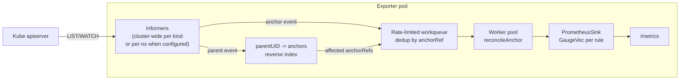

# Optimize metadata-exporter: efficiency and lower apiserver load

## Goals

- Cut redundant CPU from parent events (currently O(anchors in namespace) per update).
- Reduce apiserver watch-connection count when not using explicit namespace scoping.
- Let operators cap client-go pressure on the apiserver via QPS/Burst.

The work is staged so each phase is independently useful and shippable.

## Phase 1 — Smarter reconcile loop (biggest win, no deployment changes)

### 1.1 Introduce a workqueue and single-flight reconciler

Today `attachAnchorHandler` and `attachParentHandler` in [pkg/collector/collector.go](pkg/collector/collector.go) invoke `reconcileAnchor` synchronously from the informer goroutine. Replace with a `client-go` rate-limited `workqueue.TypedRateLimitingInterface[anchorRef]` where `anchorRef = {ruleName, anchorKind, namespace, name}`. Informer handlers only `Add`; a small pool of worker goroutines pulls from the queue.

Benefits:
- Natural deduplication (10 updates to a Deployment in 1s collapses to one reconcile per affected anchor).
- Back-pressure control (bounded workers, start with 4).
- Cleaner shutdown and retry behavior with rate-limited requeue.

Add self-metrics for observability:
- `exporter_reconcile_queue_depth` (gauge)
- `exporter_reconcile_total{rule,result}` (counter)
- `exporter_reconcile_duration_seconds` (histogram)

### 1.2 Replace "rescan whole namespace" with a reverse index

This replaces the loop in `attachParentHandler`:

```200:228:pkg/collector/collector.go
requeue := func(obj interface{}) {
	...
	for anchorKind, rs := range byAnchorKind {
		for _, anchor := range c.informers.ListAll(anchorKind) {
			if ns != "" {
				if m, ok := metaAccessor(anchor); ok && m.GetNamespace() != ns {
					continue
				}
			}
			c.reconcileAnchor(anchor, rs)
		}
	}
}
```

Add a `parentIndex` (sync.Map or mutex-guarded map):
- Key: `parentUID` (string)
- Value: `set<anchorRef>`

Every successful `reconcileAnchor` records the parent UIDs it read (the Resolver already walks them in [pkg/collector/resolver.go](pkg/collector/resolver.go)). On delete of an anchor, remove entries. On parent event, look up the parent UID and enqueue only those anchors.

Fallback when the mapping is empty (cold start after process restart): for unknown parent UIDs, fall back to the current per-namespace scan once and populate the index.

### 1.3 Event-level filters

In `attachParentHandler`, add an `UpdateFunc` predicate:
- Skip when `oldMeta.ResourceVersion == newMeta.ResourceVersion`.
- Skip when nothing in the cached object's `metadata` and the paths the rule reads actually changed. Cheap first version: compare `metadata.generation` + `metadata.labels` + `metadata.annotations` hashes. Precise diffing can come later.

### 1.4 QPS/Burst and rate-limiter flags

In [cmd/main.go](cmd/main.go) `buildRestConfig`:

```go
cfg.QPS = float32(*kubeQPS)
cfg.Burst = *kubeBurst
```

Add flags `--kube-api-qps` (default 20) and `--kube-api-burst` (default 40). Document them in [README.md](README.md) and [docs/CONFIG.md](docs/CONFIG.md).

## Phase 2 — Hybrid watch topology (reduce watch connections)

Current code in [pkg/collector/listers.go](pkg/collector/listers.go) creates `len(namespaces) x 5` factories. Switch to a hybrid rule:

- If `cfg.Watch.Namespaces` is non-empty: keep existing per-namespace factories (users opt in when they need that isolation).
- If `cfg.Watch.Namespaces` is empty: build exactly one cluster-wide factory per kind (~5 watches total), with the existing selector tweak applied. Namespace filtering happens in the event handler (cheap, cached).

Changes:
- `NewScopedInformers` branches on `len(namespaces) == 0` and builds a single `factories[""]` map.
- `Informers(kind)` already iterates per namespace; unchanged in cluster-wide mode because there is only one `""` entry.
- `nsKey` already returns `""` when the cluster-wide lister exists.

Add a startup log line summarizing active mode: `watch mode = cluster-wide | per-namespace(N)`.

## Phase 3 — Docs, tests, and rollout notes (without sharding scope)

- Expand [docs/CONFIG.md](docs/CONFIG.md): new flags, queue/index behavior, and when to use cluster-wide vs per-namespace mode.
- Add unit tests:
  - Reverse index correctness: parent event enqueues only recorded anchors.
  - Workqueue dedup under burst (Add 100 times, 1 reconcile).
  - Update-event filter behavior to ensure no-op updates are skipped.
- Update integration tests in [test/integration/run.sh](test/integration/run.sh):
  - Parent update should only trigger affected anchors (not namespace-wide rescan).
  - Existing metric correctness must remain unchanged.

## Data flow after changes



## Risk and sequencing notes

- Phase 1 and Phase 2 are safe to ship independently and already meaningfully reduce load.
- Keep server-side selectors enabled; avoid replacing them with client-side filtering.
- All phases preserve the existing `MetadataSink` contract, so `ReplaceForAnchor` semantics in [pkg/sink/prometheus.go](pkg/sink/prometheus.go) remain untouched.
